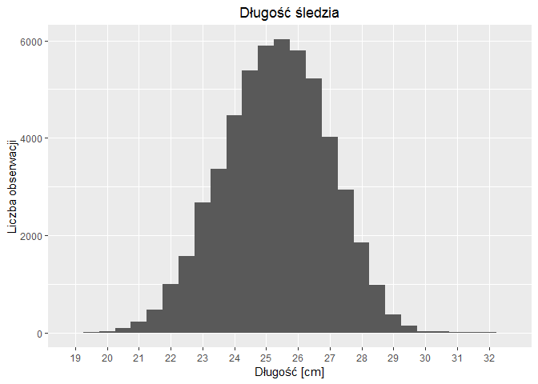
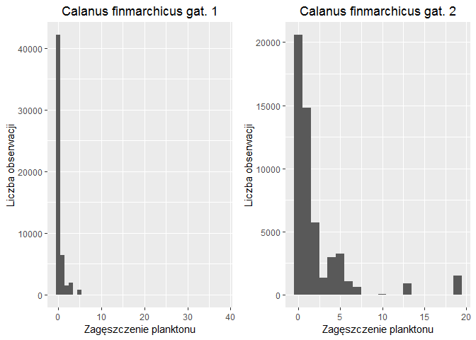
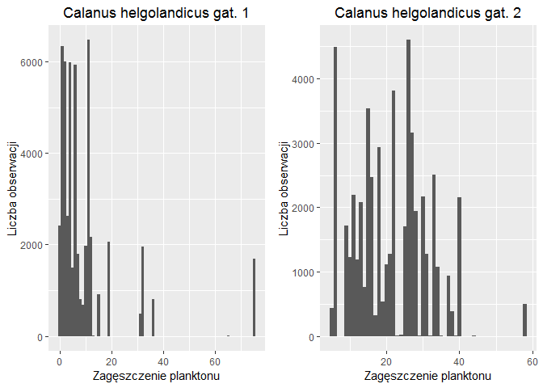
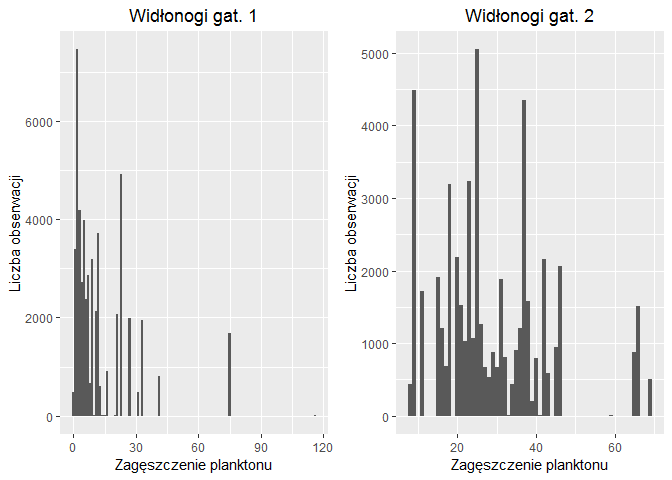
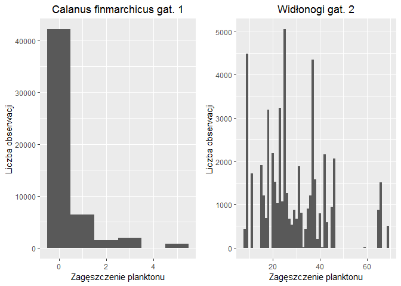
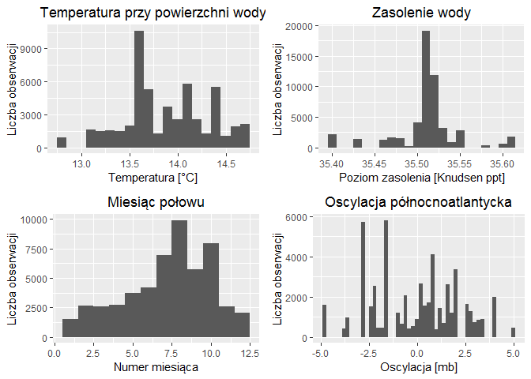
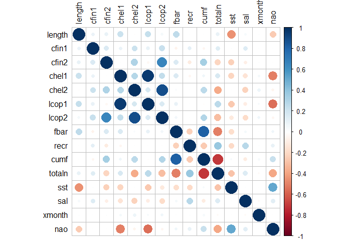
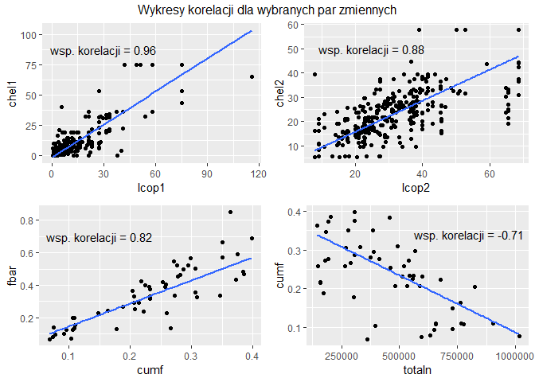
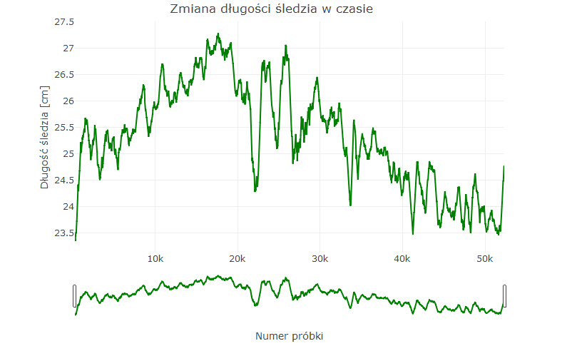

## Podsumowanie

Dane zawierają informacje o warunkach hodowli i połowch śledzi, zmienną decyzyjną jest długość śledzia. Jej rozkład zbliżony jest do rozkładu normalnego. Na etapie wizualnej eksploracji danych zaobserwowano spadek długości śledzia w czasie. Analiza korelacji nie doprowadziła do stwierdzenia zależności między atrybutami a zmienną decyzyjną, naomiast wykazała wysoką współzależność zagęszczenia *Calanus finmarchicus gat. 1* oraz *zagęszczenia Calanus helgolandicus gat. 1*. W celu predykcji rozmiaru śledzia zastosowano 3 modele uczenia maszynowego: regresję liniową, metodę wektorów nośnych (SVM) oraz eXtreme gradient boosting (XGB). Analiza ważności atrybutów doprowadziła do wniosku, że najbardziej istotną przyczyną spadku długości śledzia była temperatura przy powierzchni wody.


## Wykorzstane biblioteki:
* knitr
* ggplot2 
* tidyr 
* imputeTS 
* kableExtra 
* gridExtra 
* corrplot 
* plotly 
* catboost 
* caret 
* dummies 
* mltools 
* kernlab 


## Powtarzalność eksperymentów

W celu zapewnienia powtarzalności wyników dla uruchamianego wielokrotnie kodu należy ustawić tzw. ziarno. Użyłam ziarna równego 64.


```r
set.seed(64)
```

## Wczytanie danych z pliku

Brakujące dane w pliku zostały oznaczone znakiem zapytania. Wczytanie danych z parametrem *na* pozwala na zastąpienie ich wyrażeniem **NA** rozpoznawanym przez język **R** jako brakujące dane.


```r
dataset <- read.csv("sledzie.csv", na=c('?'))
dataset['X'] <- NULL
```

Kolumna **X** zawierająca numer próbki nie jest użyteczna w analizie, dlatego została usunięta.


## Podstawowe informacje o danych
Każdy wiersz danych zawiera jeden atrybut decyzyjny, którym jest długość złowionego sledzia podana w centymetrach **length** oraz 14 atrybutów predycyjnych, które mozna podzielić na trzy główne grupy:

* Dostępność planktonu
    + __cfin1__: dostępność planktonu [zagęszczenie Calanus finmarchicus gat. 1];
    + __cfin2__: dostępność planktonu [zagęszczenie Calanus finmarchicus gat. 2];
    + __chel1__: dostępność planktonu [zagęszczenie Calanus helgolandicus gat. 1];
    + __chel2__: dostępność planktonu [zagęszczenie Calanus helgolandicus gat. 2];
    + __lcop1__: dostępność planktonu [zagęszczenie widłonogów gat. 1];
    + __lcop2__: dostępność planktonu [zagęszczenie widłonogów gat. 2];
* Dane dotyczące liczby śledzi
    +  __fbar__: natężenie połowów w regionie [ułamek pozostawionego narybku];
    +  __recr__: roczny narybek [liczba śledzi];
    +  __cumf__: łączne roczne natężenie połowów w regionie [ułamek pozostawionego narybku];
    +  __totaln__: łączna liczba ryb złowionych w ramach połowu [liczba śledzi];
* Warunki przyrodnicze 
    +  __sst__: temperatura przy powierzchni wody [°C];
    +  __sal__: poziom zasolenia wody [Knudsen ppt];
    +  __xmonth__: miesiąc połowu [numer miesiąca];
    +  __nao__: oscylacja północnoatlantycka [mb].
    
Wszystkie atrybuty z wyjątkiem miesiąca połowu *(xmonth)* są atrybutami numerycznymi. Miesiąc połowu jest atrybutem kategorycznym.
Dane składają się z 52 582 wierszy.

Poniżej przedstawiono podstawowe statystyki dla każdego z atrybutów:


```r
basic_stats <- simplify2array(summary(dataset))
basic_stats %>%
  kable() %>%
  kable_styling() %>%
  scroll_box(width = "900px")
```

<div style="border: 1px solid #ddd; padding: 5px; overflow-x: scroll; width:900px; "><table class="table" style="margin-left: auto; margin-right: auto;">
 <thead>
  <tr>
   <th style="text-align:left;">   </th>
   <th style="text-align:left;">     length </th>
   <th style="text-align:left;">     cfin1 </th>
   <th style="text-align:left;">     cfin2 </th>
   <th style="text-align:left;">     chel1 </th>
   <th style="text-align:left;">     chel2 </th>
   <th style="text-align:left;">     lcop1 </th>
   <th style="text-align:left;">     lcop2 </th>
   <th style="text-align:left;">      fbar </th>
   <th style="text-align:left;">      recr </th>
   <th style="text-align:left;">      cumf </th>
   <th style="text-align:left;">     totaln </th>
   <th style="text-align:left;">      sst </th>
   <th style="text-align:left;">      sal </th>
   <th style="text-align:left;">     xmonth </th>
   <th style="text-align:left;">      nao </th>
  </tr>
 </thead>
<tbody>
  <tr>
   <td style="text-align:left;">  </td>
   <td style="text-align:left;"> Min.   :19.0 </td>
   <td style="text-align:left;"> Min.   : 0.0000 </td>
   <td style="text-align:left;"> Min.   : 0.0000 </td>
   <td style="text-align:left;"> Min.   : 0.000 </td>
   <td style="text-align:left;"> Min.   : 5.238 </td>
   <td style="text-align:left;"> Min.   :  0.3074 </td>
   <td style="text-align:left;"> Min.   : 7.849 </td>
   <td style="text-align:left;"> Min.   :0.0680 </td>
   <td style="text-align:left;"> Min.   : 140515 </td>
   <td style="text-align:left;"> Min.   :0.06833 </td>
   <td style="text-align:left;"> Min.   : 144137 </td>
   <td style="text-align:left;"> Min.   :12.77 </td>
   <td style="text-align:left;"> Min.   :35.40 </td>
   <td style="text-align:left;"> Min.   : 1.000 </td>
   <td style="text-align:left;"> Min.   :-4.89000 </td>
  </tr>
  <tr>
   <td style="text-align:left;">  </td>
   <td style="text-align:left;"> 1st Qu.:24.0 </td>
   <td style="text-align:left;"> 1st Qu.: 0.0000 </td>
   <td style="text-align:left;"> 1st Qu.: 0.2778 </td>
   <td style="text-align:left;"> 1st Qu.: 2.469 </td>
   <td style="text-align:left;"> 1st Qu.:13.427 </td>
   <td style="text-align:left;"> 1st Qu.:  2.5479 </td>
   <td style="text-align:left;"> 1st Qu.:17.808 </td>
   <td style="text-align:left;"> 1st Qu.:0.2270 </td>
   <td style="text-align:left;"> 1st Qu.: 360061 </td>
   <td style="text-align:left;"> 1st Qu.:0.14809 </td>
   <td style="text-align:left;"> 1st Qu.: 306068 </td>
   <td style="text-align:left;"> 1st Qu.:13.60 </td>
   <td style="text-align:left;"> 1st Qu.:35.51 </td>
   <td style="text-align:left;"> 1st Qu.: 5.000 </td>
   <td style="text-align:left;"> 1st Qu.:-1.89000 </td>
  </tr>
  <tr>
   <td style="text-align:left;">  </td>
   <td style="text-align:left;"> Median :25.5 </td>
   <td style="text-align:left;"> Median : 0.1111 </td>
   <td style="text-align:left;"> Median : 0.7012 </td>
   <td style="text-align:left;"> Median : 5.750 </td>
   <td style="text-align:left;"> Median :21.673 </td>
   <td style="text-align:left;"> Median :  7.0000 </td>
   <td style="text-align:left;"> Median :24.859 </td>
   <td style="text-align:left;"> Median :0.3320 </td>
   <td style="text-align:left;"> Median : 421391 </td>
   <td style="text-align:left;"> Median :0.23191 </td>
   <td style="text-align:left;"> Median : 539558 </td>
   <td style="text-align:left;"> Median :13.86 </td>
   <td style="text-align:left;"> Median :35.51 </td>
   <td style="text-align:left;"> Median : 8.000 </td>
   <td style="text-align:left;"> Median : 0.20000 </td>
  </tr>
  <tr>
   <td style="text-align:left;">  </td>
   <td style="text-align:left;"> Mean   :25.3 </td>
   <td style="text-align:left;"> Mean   : 0.4458 </td>
   <td style="text-align:left;"> Mean   : 2.0248 </td>
   <td style="text-align:left;"> Mean   :10.006 </td>
   <td style="text-align:left;"> Mean   :21.221 </td>
   <td style="text-align:left;"> Mean   : 12.8108 </td>
   <td style="text-align:left;"> Mean   :28.419 </td>
   <td style="text-align:left;"> Mean   :0.3304 </td>
   <td style="text-align:left;"> Mean   : 520367 </td>
   <td style="text-align:left;"> Mean   :0.22981 </td>
   <td style="text-align:left;"> Mean   : 514973 </td>
   <td style="text-align:left;"> Mean   :13.87 </td>
   <td style="text-align:left;"> Mean   :35.51 </td>
   <td style="text-align:left;"> Mean   : 7.258 </td>
   <td style="text-align:left;"> Mean   :-0.09236 </td>
  </tr>
  <tr>
   <td style="text-align:left;">  </td>
   <td style="text-align:left;"> 3rd Qu.:26.5 </td>
   <td style="text-align:left;"> 3rd Qu.: 0.3333 </td>
   <td style="text-align:left;"> 3rd Qu.: 1.7936 </td>
   <td style="text-align:left;"> 3rd Qu.:11.500 </td>
   <td style="text-align:left;"> 3rd Qu.:27.193 </td>
   <td style="text-align:left;"> 3rd Qu.: 21.2315 </td>
   <td style="text-align:left;"> 3rd Qu.:37.232 </td>
   <td style="text-align:left;"> 3rd Qu.:0.4560 </td>
   <td style="text-align:left;"> 3rd Qu.: 724151 </td>
   <td style="text-align:left;"> 3rd Qu.:0.29803 </td>
   <td style="text-align:left;"> 3rd Qu.: 730351 </td>
   <td style="text-align:left;"> 3rd Qu.:14.16 </td>
   <td style="text-align:left;"> 3rd Qu.:35.52 </td>
   <td style="text-align:left;"> 3rd Qu.: 9.000 </td>
   <td style="text-align:left;"> 3rd Qu.: 1.63000 </td>
  </tr>
  <tr>
   <td style="text-align:left;">  </td>
   <td style="text-align:left;"> Max.   :32.5 </td>
   <td style="text-align:left;"> Max.   :37.6667 </td>
   <td style="text-align:left;"> Max.   :19.3958 </td>
   <td style="text-align:left;"> Max.   :75.000 </td>
   <td style="text-align:left;"> Max.   :57.706 </td>
   <td style="text-align:left;"> Max.   :115.5833 </td>
   <td style="text-align:left;"> Max.   :68.736 </td>
   <td style="text-align:left;"> Max.   :0.8490 </td>
   <td style="text-align:left;"> Max.   :1565890 </td>
   <td style="text-align:left;"> Max.   :0.39801 </td>
   <td style="text-align:left;"> Max.   :1015595 </td>
   <td style="text-align:left;"> Max.   :14.73 </td>
   <td style="text-align:left;"> Max.   :35.61 </td>
   <td style="text-align:left;"> Max.   :12.000 </td>
   <td style="text-align:left;"> Max.   : 5.08000 </td>
  </tr>
  <tr>
   <td style="text-align:left;">  </td>
   <td style="text-align:left;"> NA </td>
   <td style="text-align:left;"> NA's   :1581 </td>
   <td style="text-align:left;"> NA's   :1536 </td>
   <td style="text-align:left;"> NA's   :1555 </td>
   <td style="text-align:left;"> NA's   :1556 </td>
   <td style="text-align:left;"> NA's   :1653 </td>
   <td style="text-align:left;"> NA's   :1591 </td>
   <td style="text-align:left;"> NA </td>
   <td style="text-align:left;"> NA </td>
   <td style="text-align:left;"> NA </td>
   <td style="text-align:left;"> NA </td>
   <td style="text-align:left;"> NA's   :1584 </td>
   <td style="text-align:left;"> NA </td>
   <td style="text-align:left;"> NA </td>
   <td style="text-align:left;"> NA </td>
  </tr>
</tbody>
</table></div>
## Przetwarzanie brakujących danych

Pakietem umozliwiającym wygodne przetwarzanie brakujących danych jest **imputeTS**. Z jego pomocą możemy obejrzeć statyski dotyczące brakujących danych:


```r
stats <- sapply(dataset, statsNA, printOnly = FALSE)
stats %>%
  kable() %>%
  kable_styling() %>%
  scroll_box(width = "900px")
```

<div style="border: 1px solid #ddd; padding: 5px; overflow-x: scroll; width:900px; "><table class="table" style="margin-left: auto; margin-right: auto;">
 <thead>
  <tr>
   <th style="text-align:left;">   </th>
   <th style="text-align:left;"> length </th>
   <th style="text-align:left;"> cfin1 </th>
   <th style="text-align:left;"> cfin2 </th>
   <th style="text-align:left;"> chel1 </th>
   <th style="text-align:left;"> chel2 </th>
   <th style="text-align:left;"> lcop1 </th>
   <th style="text-align:left;"> lcop2 </th>
   <th style="text-align:left;"> fbar </th>
   <th style="text-align:left;"> recr </th>
   <th style="text-align:left;"> cumf </th>
   <th style="text-align:left;"> totaln </th>
   <th style="text-align:left;"> sst </th>
   <th style="text-align:left;"> sal </th>
   <th style="text-align:left;"> xmonth </th>
   <th style="text-align:left;"> nao </th>
  </tr>
 </thead>
<tbody>
  <tr>
   <td style="text-align:left;"> lengthTimeSeries </td>
   <td style="text-align:left;"> 52582 </td>
   <td style="text-align:left;"> 52582 </td>
   <td style="text-align:left;"> 52582 </td>
   <td style="text-align:left;"> 52582 </td>
   <td style="text-align:left;"> 52582 </td>
   <td style="text-align:left;"> 52582 </td>
   <td style="text-align:left;"> 52582 </td>
   <td style="text-align:left;"> 52582 </td>
   <td style="text-align:left;"> 52582 </td>
   <td style="text-align:left;"> 52582 </td>
   <td style="text-align:left;"> 52582 </td>
   <td style="text-align:left;"> 52582 </td>
   <td style="text-align:left;"> 52582 </td>
   <td style="text-align:left;"> 52582 </td>
   <td style="text-align:left;"> 52582 </td>
  </tr>
  <tr>
   <td style="text-align:left;"> numberNAs </td>
   <td style="text-align:left;"> 0 </td>
   <td style="text-align:left;"> 1581 </td>
   <td style="text-align:left;"> 1536 </td>
   <td style="text-align:left;"> 1555 </td>
   <td style="text-align:left;"> 1556 </td>
   <td style="text-align:left;"> 1653 </td>
   <td style="text-align:left;"> 1591 </td>
   <td style="text-align:left;"> 0 </td>
   <td style="text-align:left;"> 0 </td>
   <td style="text-align:left;"> 0 </td>
   <td style="text-align:left;"> 0 </td>
   <td style="text-align:left;"> 1584 </td>
   <td style="text-align:left;"> 0 </td>
   <td style="text-align:left;"> 0 </td>
   <td style="text-align:left;"> 0 </td>
  </tr>
  <tr>
   <td style="text-align:left;"> percentageNAs </td>
   <td style="text-align:left;"> 0% </td>
   <td style="text-align:left;"> 3.01% </td>
   <td style="text-align:left;"> 2.92% </td>
   <td style="text-align:left;"> 2.96% </td>
   <td style="text-align:left;"> 2.96% </td>
   <td style="text-align:left;"> 3.14% </td>
   <td style="text-align:left;"> 3.03% </td>
   <td style="text-align:left;"> 0% </td>
   <td style="text-align:left;"> 0% </td>
   <td style="text-align:left;"> 0% </td>
   <td style="text-align:left;"> 0% </td>
   <td style="text-align:left;"> 3.01% </td>
   <td style="text-align:left;"> 0% </td>
   <td style="text-align:left;"> 0% </td>
   <td style="text-align:left;"> 0% </td>
  </tr>
  <tr>
   <td style="text-align:left;"> naGapLongest </td>
   <td style="text-align:left;"> NA </td>
   <td style="text-align:left;"> 3 </td>
   <td style="text-align:left;"> 3 </td>
   <td style="text-align:left;"> 3 </td>
   <td style="text-align:left;"> 3 </td>
   <td style="text-align:left;"> 2 </td>
   <td style="text-align:left;"> 3 </td>
   <td style="text-align:left;"> NA </td>
   <td style="text-align:left;"> NA </td>
   <td style="text-align:left;"> NA </td>
   <td style="text-align:left;"> NA </td>
   <td style="text-align:left;"> 3 </td>
   <td style="text-align:left;"> NA </td>
   <td style="text-align:left;"> NA </td>
   <td style="text-align:left;"> NA </td>
  </tr>
  <tr>
   <td style="text-align:left;"> naGapMostFrequent </td>
   <td style="text-align:left;"> 52582 </td>
   <td style="text-align:left;"> 1 </td>
   <td style="text-align:left;"> 1 </td>
   <td style="text-align:left;"> 1 </td>
   <td style="text-align:left;"> 1 </td>
   <td style="text-align:left;"> 1 </td>
   <td style="text-align:left;"> 1 </td>
   <td style="text-align:left;"> 52582 </td>
   <td style="text-align:left;"> 52582 </td>
   <td style="text-align:left;"> 52582 </td>
   <td style="text-align:left;"> 52582 </td>
   <td style="text-align:left;"> 1 </td>
   <td style="text-align:left;"> 52582 </td>
   <td style="text-align:left;"> 52582 </td>
   <td style="text-align:left;"> 52582 </td>
  </tr>
  <tr>
   <td style="text-align:left;"> naGapMostOverallNAs </td>
   <td style="text-align:left;"> 52582 </td>
   <td style="text-align:left;"> 1 </td>
   <td style="text-align:left;"> 1 </td>
   <td style="text-align:left;"> 1 </td>
   <td style="text-align:left;"> 1 </td>
   <td style="text-align:left;"> 1 </td>
   <td style="text-align:left;"> 1 </td>
   <td style="text-align:left;"> 52582 </td>
   <td style="text-align:left;"> 52582 </td>
   <td style="text-align:left;"> 52582 </td>
   <td style="text-align:left;"> 52582 </td>
   <td style="text-align:left;"> 1 </td>
   <td style="text-align:left;"> 52582 </td>
   <td style="text-align:left;"> 52582 </td>
   <td style="text-align:left;"> 52582 </td>
  </tr>
</tbody>
</table></div>

Procent brakujących danych nie jest wysoki - liczba pustych wartości nie przekracza 3% w każdej z kolumn??? **Sprawdzić**. Mimo, że nie jest to duży odsetek, brakujące dane mogą negatywnie wpływać na zdolności predykcyjne niektórych modeli uczenia maszynowego.

Istnieje wiele sposobów na uporanie się z brakującymi danymi. Wiersze, które zawierają takie dane można usunąć, wypełnić zawartością bądź zostawić w formie niezmienionej. Najczęstszą strategią, zapobiegającą utracie danych i umożliwiającą przeprowadzenie procesu uczenia maszynowego jest wypełnienie braków danymi syntetycznymi. W tym celu dla kolumn, które zawierają wartości puste wykorzystałam interpolację wartości.


```r
dataset$cfin1 <- na.interpolation(dataset$cfin1)
dataset$cfin2 <- na.interpolation(dataset$cfin2)
dataset$chel1 <- na.interpolation(dataset$chel1)
dataset$chel2 <- na.interpolation(dataset$chel2)
dataset$lcop1 <- na.interpolation(dataset$lcop1)
dataset$lcop2 <- na.interpolation(dataset$lcop2)
dataset$sst <- na.interpolation(dataset$sst)
```

## Analiza wartości atrybutów

W tej sekcji przedstawiono rozkład wartości dla poszczególnych atrybutów.

### Długość śledzia


```r
p_length <- ggplot(dataset, aes(length)) +
     geom_histogram(binwidth = 0.5) + 
     scale_x_discrete(name="Długość [cm]", limits= seq(min(dataset$length), max(dataset$length), by=1) ) +
     ylab("Liczba obserwacji") +
     ggtitle("Długość śledzia") + 
     theme(plot.title = element_text(hjust = 0.5))
```

<!-- -->

Rozkład wartości długości śledzia jest zbliżony do rozkładu normalnego o średniej ok. 25.5 cm.

### Zagęszczenie planktonu

```r
p_cfin1 <- ggplot(dataset, aes(cfin1)) + geom_histogram(binwidth = 1.0) + xlab("Zagęszczenie planktonu") +
  ylab("Liczba obserwacji") + ggtitle("Calanus finmarchicus gat. 1") + theme(plot.title = element_text(hjust = 0.5))

p_cfin2 <- ggplot(dataset, aes(cfin2)) + geom_histogram(binwidth = 1.0) + xlab("Zagęszczenie planktonu") +  
  ylab("Liczba obserwacji") + ggtitle("Calanus finmarchicus gat. 2") + theme(plot.title = element_text(hjust = 0.5))

grid.arrange(p_cfin1, p_cfin2, ncol = 2, nrow = 1)
```

<!-- -->

```r
p_chel1 <- ggplot(dataset, aes(chel1)) +  geom_histogram(binwidth = 1.0) + xlab("Zagęszczenie planktonu") +
  ylab("Liczba obserwacji") + ggtitle("Calanus helgolandicus gat. 1") + theme(plot.title = element_text(hjust = 0.5))

p_chel2 <- ggplot(dataset, aes(chel2)) +  geom_histogram(binwidth = 1.0) + xlab("Zagęszczenie planktonu") +  
  ylab("Liczba obserwacji") + ggtitle("Calanus helgolandicus gat. 2") + theme(plot.title = element_text(hjust = 0.5))

grid.arrange(p_chel1, p_chel2, ncol = 2, nrow = 1)
```

<!-- -->

```r
p_lcop1 <- ggplot(dataset, aes(x=lcop1)) +  geom_histogram(binwidth = 1.0) + xlab("Zagęszczenie planktonu") +
  ylab("Liczba obserwacji") + ggtitle("Widłonogi gat. 1") + theme(plot.title = element_text(hjust = 0.5))

p_lcop2 <- ggplot(dataset, aes(x=lcop2)) +  geom_histogram(binwidth = 1.0) +   xlab("Zagęszczenie planktonu") +  
  ylab("Liczba obserwacji") + ggtitle("Widłonogi gat. 2") + theme(plot.title = element_text(hjust = 0.5))

grid.arrange(p_lcop1, p_lcop2, ncol = 2, nrow = 1)
```

<!-- -->

Z wykresów wynika, że w większości przypadkóW zagęszczenie planktonu ma rozkład prawostronnie skośny. Dla *Calanus finmarchicus gat. 1* oraz *Widłonogów gat. 1* obserwujemy występowanie wartości odstających tzw. *outlierów*. Mogą być one skutkiem błędów popełnionych przy zbieraniu danych i negatywnie wpływać na dalszą analizę. Aby nie tracić zupełnie danych z wierszy, dla których niektóre atrybuty są outlierami, zastąpiono je wartościami *NA*, a następnie przeprowadzono interpolację.


```r
replace_cfin1 <- which(dataset$cfin1 > 20)
replace_lcop1 <- which(dataset$cfin1 > 90)

for (i in replace_cfin1){
  dataset[i, "cfin1"] <- NA
}
for (j in replace_lcop1){
  dataset[i, "lcop1"] <- NA
}

dataset$cfin1 <- na.interpolation(dataset$cfin1)
dataset$lcop1 <- na.interpolation(dataset$lcop1)
```

Po przetworzeniu wartości odstających rozkład *Calanus finmarchicus gat. 1* i *Widłonogów gat. 1* jest bardziej równomierny i prezentuje się następująco:

<!-- -->

### Dane dotyczące liczby śledzi


```r
p_fbar <- ggplot(dataset, aes(fbar)) + geom_histogram(binwidth = 0.05) + xlab("Ułamek pozostawionego narybku")+
  ylab("Liczba obserwacji") + ggtitle("Natężenie połowów w regionie") + theme(plot.title = element_text(hjust = 0.5))

p_recr <- ggplot(dataset, aes(recr)) + geom_histogram(binwidth = 50000.0) + xlab("Liczba śledzi")+
  ylab("Liczba obserwacji") + ggtitle("Roczny narybek") + theme(plot.title = element_text(hjust = 0.5))

p_cumf <- ggplot(dataset, aes(cumf)) + geom_histogram(binwidth = 0.02) + xlab("Ułamek pozostawionego narybku")+
  ylab("Liczba obserwacji") + ggtitle("Łączne roczne natężenie połowów") + theme(plot.title = element_text(hjust = 0.5))

p_totaln <- ggplot(dataset, aes(totaln)) + geom_histogram(binwidth = 50000.0) + xlab("Liczba śledzi")+
  ylab("Liczba obserwacji") + ggtitle("Łączna liczba złowionych ryb") + theme(plot.title = element_text(hjust = 0.5))

grid.arrange(p_fbar, p_recr, p_cumf, p_totaln, ncol = 2, nrow = 2)
```

<!-- -->

Dane dotyczące liczby śledzi w łowiskach mają rozkład dużo bardziej równomierny niż dane dotyczące zagęszczenia planktonu. Natężenia połowów mają rozkład wielomodalny.


### Warunki przyrodnicze


```r
p_sst <- ggplot(dataset, aes(sst)) + geom_histogram(binwidth = 0.1) + xlab("Temperatura [°C]")+ 
  ylab("Liczba obserwacji")+ ggtitle("Temperatura przy powierzchni wody")+ theme(plot.title = element_text(hjust=0.5))

p_sal <- ggplot(dataset, aes(sal)) + geom_histogram(binwidth = 0.01) + xlab("Poziom zasolenia [Knudsen ppt]")+ 
  ylab("Liczba obserwacji") + ggtitle("Zasolenie wody") + theme(plot.title=element_text(hjust=0.5))

p_xmonth <- ggplot(dataset, aes(xmonth)) + geom_histogram(binwidth = 1.0) + xlab("Numer miesiąca")+
  ylab("Liczba obserwacji") + ggtitle("Miesiąc połowu") +  theme(plot.title=element_text(hjust=0.5))

p_nao <- ggplot(dataset, aes(nao)) + geom_histogram(binwidth = 0.2) + xlab("Oscylacja [mb]")+ 
  ylab("Liczba obserwacji") + ggtitle("Oscylacja północnoatlantycka") + theme(plot.title=element_text(hjust=0.5))

grid.arrange(p_sst, p_sal, p_xmonth, p_nao, ncol = 2, nrow = 2)
```

<!-- -->

Najczęściej odnotowaną temperaturą wody było 13.6°C. Może być to związane z faktem, że najwięcej danych zostało zebranych w miesiącach letnich - szczególnie w sierpniu. Zasolenie wody koncentruje się głównie w przedziale 35.5 - 35.55 z niewielkimi odstępstwami. 

## Korelacje między zmiennymi

Poniżej przedstawiono moacierz korelacji dla atrybutów.


```r
corrplot(cor(dataset), tl.col="black")
```

<!-- -->

Żaden z atrybutów nie wykazuje wysokiego współczynnika korelacji w stosunku do atrybutu decyzyjnego *length*. Najwyższą pozytywną korelację można zaobserwować dla par *zagęszczenie widłonogów gat. 1 (lcop1)* oraz *zagęszczenie Calanus helgolandicus gat. 1 (chel1)*, *zagęszczenie widłonogów gat. 2 (lcop2)* oraz *zagęszczenie Calanus helgolandicus gat. 2 (chel2)* a także *łączne roczne natężenie połowów w regionie (cumf)* oraz *natężenie połowów w regionie (fbar)*. Negatywną korelację wykazuje para *łączna liczba ryb złowionych w ramach połowu (totaln)* oraz *łączne roczne natężenie połowów w regionie (cumf)*. Przyjrzyjmy się im bliżej.


```r
p_lcop1_chel1 <- ggplot(dataset, aes(x=lcop1, y=chel1)) + geom_point() + geom_smooth(method=lm) + annotate("text", x = 30, y = 87.25,
  label = c(paste("wsp. korelacji =", round(cor(dataset$lcop1, dataset$chel1),2))))
p_lcop2_chel2 <- ggplot(dataset, aes(x=lcop2, y=chel2)) + geom_point() + geom_smooth(method=lm) + annotate("text", x = 25, y = 50,
  label = c(paste("wsp. korelacji =", round(cor(dataset$lcop2, dataset$chel2),2))))
p_cumf_fbar   <- ggplot(dataset, aes(x=cumf, y=fbar)) + geom_point() + geom_smooth(method=lm) + annotate("text", x = 0.15, y = 0.7,
  label = c(paste("wsp. korelacji =", round(cor(dataset$cumf, dataset$fbar),2))))
p_totaln_cumf <- ggplot(dataset, aes(x=totaln, y=cumf)) + geom_point() + geom_smooth(method=lm) + annotate("text", x = 800000, y = 0.34,
  label = c(paste("wsp. korelacji =", round(cor(dataset$totaln, dataset$cumf),2))))

grid.arrange(p_lcop1_chel1 , p_lcop2_chel2, p_cumf_fbar, p_totaln_cumf, ncol = 2, nrow = 2, top="Wykresy korelacji dla wybranych par zmiennych")
```

<!-- -->

Istotnie, korelacja wskazanych par zmiennych jest wysoka. Ta informacja zostanie wykorzystana na etapie budowy modeli decyzyjnych.


## Zmiana długości śledzia w czasie
Poniżej predstawiono wykres zmiany długości śledzia w czasie. W celu lepszej wizualizacji zależności, dane zostały przetworzone za pomocą tzw. średniej kroczącej *(ang. moving average)*. Z wykorzystaniem suwaków znajdujących się pod wykresem można zawęzić przedział, z którego były pobrane próbki.

Na wykresie można dostrzec tendencję spadkową - długość śledzi od pewnego momentu zaczęła wyraźnie maleć.


```r
data <- data.frame(dataset)
data$X <- seq.int(nrow(data))
len_smooth = stats::filter(data$length, rep(1/500, 500), side=2)

plot_ly() %>%
  add_lines(x=data$X, y=len_smooth, line=list(dash="solid", width = 2.0, color="green")) %>%
  layout(
    title = "Zmiana długości śledzia w czasie",
    xaxis = list(title= "Numer próbki", rangeslider = list()),
    yaxis = list(title = "Długość śledzia [cm]"))
```

<!-- -->

## Modele predykcyjne

### Przygotowanie danych

Aby skonstruować dobry model uczenia maszynowego, konieczne jest wcześniejsze uważne przygotowanie danych. Wśród atrybutów znajduje się kolumna **xmonth** oznaczająca numer miesiąca. Mimo tego, że wartości reprezentowane są jako liczby, jest to atrybut kategoryczny. Dlatego jego wartości zostały zamienione za pomocą *one-hot encoding* - dodano 12 kolumn, z których dla każdego wiersza tylko jedna przyjmuje wartość 1, a pozostałe - 0.


```r
cols <- colnames(dataset)
dataset2 <- cbind(dataset, dummy(dataset$xmonth, sep = "_"))
cols <- c(cols, c("jan", "feb", "mar", "apr", "may", "jun", "jul", "aug", "sep", "oct", "nov", "dec"))
colnames(dataset2) <- cols
dataset2['xmonth'] <- NULL
head(dataset2) %>%
  kable() %>%
  kable_styling() %>%
  scroll_box(width = "900px")
```

<div style="border: 1px solid #ddd; padding: 5px; overflow-x: scroll; width:900px; "><table class="table" style="margin-left: auto; margin-right: auto;">
 <thead>
  <tr>
   <th style="text-align:right;"> length </th>
   <th style="text-align:right;"> cfin1 </th>
   <th style="text-align:right;"> cfin2 </th>
   <th style="text-align:right;"> chel1 </th>
   <th style="text-align:right;"> chel2 </th>
   <th style="text-align:right;"> lcop1 </th>
   <th style="text-align:right;"> lcop2 </th>
   <th style="text-align:right;"> fbar </th>
   <th style="text-align:right;"> recr </th>
   <th style="text-align:right;"> cumf </th>
   <th style="text-align:right;"> totaln </th>
   <th style="text-align:right;"> sst </th>
   <th style="text-align:right;"> sal </th>
   <th style="text-align:right;"> nao </th>
   <th style="text-align:right;"> jan </th>
   <th style="text-align:right;"> feb </th>
   <th style="text-align:right;"> mar </th>
   <th style="text-align:right;"> apr </th>
   <th style="text-align:right;"> may </th>
   <th style="text-align:right;"> jun </th>
   <th style="text-align:right;"> jul </th>
   <th style="text-align:right;"> aug </th>
   <th style="text-align:right;"> sep </th>
   <th style="text-align:right;"> oct </th>
   <th style="text-align:right;"> nov </th>
   <th style="text-align:right;"> dec </th>
  </tr>
 </thead>
<tbody>
  <tr>
   <td style="text-align:right;"> 23.0 </td>
   <td style="text-align:right;"> 0.02778 </td>
   <td style="text-align:right;"> 0.27785 </td>
   <td style="text-align:right;"> 2.46875 </td>
   <td style="text-align:right;"> 21.43548 </td>
   <td style="text-align:right;"> 2.54787 </td>
   <td style="text-align:right;"> 26.35881 </td>
   <td style="text-align:right;"> 0.356 </td>
   <td style="text-align:right;"> 482831 </td>
   <td style="text-align:right;"> 0.3059879 </td>
   <td style="text-align:right;"> 267380.8 </td>
   <td style="text-align:right;"> 14.30693 </td>
   <td style="text-align:right;"> 35.51234 </td>
   <td style="text-align:right;"> 2.8 </td>
   <td style="text-align:right;"> 0 </td>
   <td style="text-align:right;"> 0 </td>
   <td style="text-align:right;"> 0 </td>
   <td style="text-align:right;"> 0 </td>
   <td style="text-align:right;"> 0 </td>
   <td style="text-align:right;"> 0 </td>
   <td style="text-align:right;"> 1 </td>
   <td style="text-align:right;"> 0 </td>
   <td style="text-align:right;"> 0 </td>
   <td style="text-align:right;"> 0 </td>
   <td style="text-align:right;"> 0 </td>
   <td style="text-align:right;"> 0 </td>
  </tr>
  <tr>
   <td style="text-align:right;"> 22.5 </td>
   <td style="text-align:right;"> 0.02778 </td>
   <td style="text-align:right;"> 0.27785 </td>
   <td style="text-align:right;"> 2.46875 </td>
   <td style="text-align:right;"> 21.43548 </td>
   <td style="text-align:right;"> 2.54787 </td>
   <td style="text-align:right;"> 26.35881 </td>
   <td style="text-align:right;"> 0.356 </td>
   <td style="text-align:right;"> 482831 </td>
   <td style="text-align:right;"> 0.3059879 </td>
   <td style="text-align:right;"> 267380.8 </td>
   <td style="text-align:right;"> 14.30693 </td>
   <td style="text-align:right;"> 35.51234 </td>
   <td style="text-align:right;"> 2.8 </td>
   <td style="text-align:right;"> 0 </td>
   <td style="text-align:right;"> 0 </td>
   <td style="text-align:right;"> 0 </td>
   <td style="text-align:right;"> 0 </td>
   <td style="text-align:right;"> 0 </td>
   <td style="text-align:right;"> 0 </td>
   <td style="text-align:right;"> 1 </td>
   <td style="text-align:right;"> 0 </td>
   <td style="text-align:right;"> 0 </td>
   <td style="text-align:right;"> 0 </td>
   <td style="text-align:right;"> 0 </td>
   <td style="text-align:right;"> 0 </td>
  </tr>
  <tr>
   <td style="text-align:right;"> 25.0 </td>
   <td style="text-align:right;"> 0.02778 </td>
   <td style="text-align:right;"> 0.27785 </td>
   <td style="text-align:right;"> 2.46875 </td>
   <td style="text-align:right;"> 21.43548 </td>
   <td style="text-align:right;"> 2.54787 </td>
   <td style="text-align:right;"> 26.35881 </td>
   <td style="text-align:right;"> 0.356 </td>
   <td style="text-align:right;"> 482831 </td>
   <td style="text-align:right;"> 0.3059879 </td>
   <td style="text-align:right;"> 267380.8 </td>
   <td style="text-align:right;"> 14.30693 </td>
   <td style="text-align:right;"> 35.51234 </td>
   <td style="text-align:right;"> 2.8 </td>
   <td style="text-align:right;"> 0 </td>
   <td style="text-align:right;"> 0 </td>
   <td style="text-align:right;"> 0 </td>
   <td style="text-align:right;"> 0 </td>
   <td style="text-align:right;"> 0 </td>
   <td style="text-align:right;"> 0 </td>
   <td style="text-align:right;"> 1 </td>
   <td style="text-align:right;"> 0 </td>
   <td style="text-align:right;"> 0 </td>
   <td style="text-align:right;"> 0 </td>
   <td style="text-align:right;"> 0 </td>
   <td style="text-align:right;"> 0 </td>
  </tr>
  <tr>
   <td style="text-align:right;"> 25.5 </td>
   <td style="text-align:right;"> 0.02778 </td>
   <td style="text-align:right;"> 0.27785 </td>
   <td style="text-align:right;"> 2.46875 </td>
   <td style="text-align:right;"> 21.43548 </td>
   <td style="text-align:right;"> 2.54787 </td>
   <td style="text-align:right;"> 26.35881 </td>
   <td style="text-align:right;"> 0.356 </td>
   <td style="text-align:right;"> 482831 </td>
   <td style="text-align:right;"> 0.3059879 </td>
   <td style="text-align:right;"> 267380.8 </td>
   <td style="text-align:right;"> 14.30693 </td>
   <td style="text-align:right;"> 35.51234 </td>
   <td style="text-align:right;"> 2.8 </td>
   <td style="text-align:right;"> 0 </td>
   <td style="text-align:right;"> 0 </td>
   <td style="text-align:right;"> 0 </td>
   <td style="text-align:right;"> 0 </td>
   <td style="text-align:right;"> 0 </td>
   <td style="text-align:right;"> 0 </td>
   <td style="text-align:right;"> 1 </td>
   <td style="text-align:right;"> 0 </td>
   <td style="text-align:right;"> 0 </td>
   <td style="text-align:right;"> 0 </td>
   <td style="text-align:right;"> 0 </td>
   <td style="text-align:right;"> 0 </td>
  </tr>
  <tr>
   <td style="text-align:right;"> 24.0 </td>
   <td style="text-align:right;"> 0.02778 </td>
   <td style="text-align:right;"> 0.27785 </td>
   <td style="text-align:right;"> 2.46875 </td>
   <td style="text-align:right;"> 21.43548 </td>
   <td style="text-align:right;"> 2.54787 </td>
   <td style="text-align:right;"> 26.35881 </td>
   <td style="text-align:right;"> 0.356 </td>
   <td style="text-align:right;"> 482831 </td>
   <td style="text-align:right;"> 0.3059879 </td>
   <td style="text-align:right;"> 267380.8 </td>
   <td style="text-align:right;"> 14.30693 </td>
   <td style="text-align:right;"> 35.51234 </td>
   <td style="text-align:right;"> 2.8 </td>
   <td style="text-align:right;"> 0 </td>
   <td style="text-align:right;"> 0 </td>
   <td style="text-align:right;"> 0 </td>
   <td style="text-align:right;"> 0 </td>
   <td style="text-align:right;"> 0 </td>
   <td style="text-align:right;"> 0 </td>
   <td style="text-align:right;"> 1 </td>
   <td style="text-align:right;"> 0 </td>
   <td style="text-align:right;"> 0 </td>
   <td style="text-align:right;"> 0 </td>
   <td style="text-align:right;"> 0 </td>
   <td style="text-align:right;"> 0 </td>
  </tr>
  <tr>
   <td style="text-align:right;"> 22.0 </td>
   <td style="text-align:right;"> 0.02778 </td>
   <td style="text-align:right;"> 0.27785 </td>
   <td style="text-align:right;"> 2.46875 </td>
   <td style="text-align:right;"> 21.43548 </td>
   <td style="text-align:right;"> 2.54787 </td>
   <td style="text-align:right;"> 26.35881 </td>
   <td style="text-align:right;"> 0.356 </td>
   <td style="text-align:right;"> 482831 </td>
   <td style="text-align:right;"> 0.3059879 </td>
   <td style="text-align:right;"> 267380.8 </td>
   <td style="text-align:right;"> 14.30693 </td>
   <td style="text-align:right;"> 35.51234 </td>
   <td style="text-align:right;"> 2.8 </td>
   <td style="text-align:right;"> 0 </td>
   <td style="text-align:right;"> 0 </td>
   <td style="text-align:right;"> 0 </td>
   <td style="text-align:right;"> 0 </td>
   <td style="text-align:right;"> 0 </td>
   <td style="text-align:right;"> 0 </td>
   <td style="text-align:right;"> 1 </td>
   <td style="text-align:right;"> 0 </td>
   <td style="text-align:right;"> 0 </td>
   <td style="text-align:right;"> 0 </td>
   <td style="text-align:right;"> 0 </td>
   <td style="text-align:right;"> 0 </td>
  </tr>
</tbody>
</table></div>


Kolejnym krokiem jest podział zbioru na zbiór uczący, testowy i walidacyjny. Przyjęto proporcje odpowiednio: 7:2:1.


```r
trainIndex <- createDataPartition(dataset2$length, p=0.7, list=FALSE)
train <- dataset2[trainIndex,]
test <- dataset2[-trainIndex,]
testIndex <- createDataPartition(test$length, p=0.66, list=FALSE)
validate <- test[-testIndex,]
test <- test[testIndex,]

cat("train set: ", 100*nrow(train)/nrow(dataset2), "%", "\n", "test set: ", 100*nrow(test)/nrow(dataset2), "%", "\n", "validation set: ", 100*nrow(validate)/nrow(dataset2), "%")
```

```
## train set:  70.00494 % 
##  test set:  19.79955 % 
##  validation set:  10.1955 %
```

### Regresja liniowa

Pierwszą wykorzystaną metodą będzie regresja liniowa. Do treningu zastosowano optymalizację według miary RMSE.  

```r
fit_lm <- train(length~., data=train, method="lm", metric="RMSE")
```

Obliczmy błąd popełniany przez model na zbiorze walidacyjnym w ujęciu RMSE oraz R^2.

```r
predictions_lm <- predict(fit_lm, validate)
rmse_lm <- sqrt(mean((validate$length - predictions_lm)^2))
r2_lm <- cor(validate$length, predictions_lm) ^ 2
cat("RMSE: ", rmse_lm, "R2: ", r2_lm)
```

```
## RMSE:  1.362388 R2:  0.3292823
```

Regresja liniowa jest bardzo prostym modelem uczenia maszynowego o ograniczonych możliwościach, jednak błąd popełniony przez tą metodę nie jest bardzo duży.

### SVM

Kolejnym regresorem wykorzystanym do predykcji długości śledzia jest metoda wektorów nośnych *(ang. support vector machines, SVM)*. Implementacja tej metody znajduje się w pakiecie **kernlab**. 

```r
fit_svm <- ksvm(length~., train)
predictions_svm <- predict(fit_svm, validate)
rmse_svm <- sqrt(mean((validate$length - predictions_svm)^2))
r2_svm <- cor(validate$length, predictions_svm) ^ 2
cat("RMSE: ", rmse_svm, "R2: ", r2_svm)
```

```
## RMSE:  1.152424 R2:  0.5200524
```

Otrzymane wyniki są lepsze niż w przypadku regresji liniowej wedle miary RMSE, natomiast gorsze wedle R^2.W tym przypadku SVM trening trwał stosunkowo długo. 

### XGBoost

Ostatnią metodą jest eXtreme Gradient Boosting, w skrócie XGB. Wykorzystano implementację dostępną w pakiecie **catboost**. Metoda ta jest znana ze swojej wysokiej wydajności i efektywności. Wymaga innego przygotowania danych niż poprzednie metody - wymaga osobnego podania predyktorów i zmiennej wyjściowej, a także nie wymaga zakodowania one-hot zmiennych kategorialnych dzięki wbudowanemu mechanizmowi (konnieczność przekazania nazw zmiennych parametrem *cat_features*). Optymalizacja jest przeprowadzana domyslnie według miary RMSE.


```r
trainIndex_xgb <- createDataPartition(dataset$length, p=0.7, list=FALSE)
train_xgb <- dataset[trainIndex_xgb,]
test_xgb <- dataset[-trainIndex_xgb,]
testIndex_xgb <- createDataPartition(test_xgb$length, p=0.66, list=FALSE)
validate_xgb <- test_xgb[-testIndex_xgb,]
test_xgb <- test_xgb[testIndex_xgb,]
train_Y <- train_xgb$length
test_Y <- test_xgb$length
validate_Y <- validate_xgb$length
train_xgb$length <- NULL
test_xgb$length <- NULL
validate_xgb$length <- NULL

train_pool <- catboost.load_pool(train_xgb, label=train_Y, cat_features = c("xmonth"))
test_pool <- catboost.load_pool(test_xgb, label=test_Y, cat_features = c("xmonth"))
val_pool <- catboost.load_pool(validate_xgb, label=validate_Y, cat_features = c("xmonth"))

fit_params <- list(iterations = 10000)
fit_catboost <- catboost.train(train_pool, test_pool = val_pool, params=fit_params)
predictions_xgb <- catboost.predict(fit_catboost, val_pool)
rmse_xgb <- sqrt(mean((validate$length - predictions_xgb)^2))
r2_xgb <- cor(validate$length, predictions_xgb) ^ 2
```


```r
cat("RMSE: ", rmse_xgb, "R2: ", r2_xgb)
```

```
## RMSE:  1.591494 R2:  0.1752335
```
Uzyskane wyniki są najlepsze z dotychczas wykorzystanych metod uczenia maszynowego pod kątem miary R^2, jednak gorsze pod względem miary RMSE. Jednakże błąd R^2 jest prawie 2 razy mniejszy niż dla najlepszego dotychczasowego wyniku wedle tej miary, a RMSE tylko nieznacznie gorsze, dlatego dalszej analizie poddano tę metodę. 

Na etapie analizy korelacji wyłoniono parę **lcop1** i **chel1** jako zmienne charakteryzujące sie najwyższym współczynnikiem korelacj równym 0.96. Spróbujmy usunąć zmienną **chel1** i zaobserwować wpływ tego zabiegu na trafność predykcji modelu. 


```r
fit_params <- list(iterations = 10000, ignored_features=c(2))
fit_catboost_ch1 <- catboost.train(train_pool, test_pool = val_pool, params=fit_params)
predictions_xgb_ch1 <- catboost.predict(fit_catboost_ch1, val_pool)
rmse_xgb_ch1 <- sqrt(mean((validate$length - predictions_xgb_ch1)^2))
r2_xgb_ch1 <- cor(validate$length, predictions_xgb_ch1) ^ 2
```


```r
cat("RMSE: ", rmse_xgb_ch1, "R2: ", r2_xgb_ch1)
```

```
## RMSE:  1.588176 R2:  0.1766239
```

Usunięcie **chel2** ze zbioru atrybutów nie przyniosło znaczącej różnicy. Oznacza to jednak, że dla tej metody można wykorzystać mniej zmiennych bez utraty jakości predykcji, co jest dobrą informacją.

### Analiza jakości predykcji na zbiorze testowym

Na koniec przetestowano zbudowane modele na zbiorze testowym. 

```r
test_lm <- predict(fit_lm, test)
test_svm <- predict(fit_svm, test)
test_xgb <- catboost.predict(fit_catboost, test_pool)
test_xgb_ch1 <- catboost.predict(fit_catboost_ch1, test_pool)

rmse_test_lm <- sqrt(mean((test$length - test_lm)^2))
r2_test_lm <- cor(test$length, test_lm) ^ 2
rmse_test_svm <- sqrt(mean((test$length - test_svm)^2))
r2_test_svm <- cor(test$length, test_svm) ^ 2
rmse_test_xgb <- sqrt(mean((test$length - test_xgb)^2))
r2_test_xgb <- cor(test$length, test_xgb) ^ 2
rmse_test_xgb_ch1 <- sqrt(mean((test$length - test_xgb_ch1)^2))
r2_test_xgb_ch1 <- cor(test$length, test_xgb_ch1) ^ 2

test_res <- data.frame("metoda" = c("regresja liniowa","SVM","XGB", "XGB bez chel1"), 
                "RMSE" = c(rmse_test_lm, rmse_test_svm, rmse_test_xgb, rmse_test_xgb_ch1), 
                "R2" =  c(r2_test_lm, r2_test_svm, r2_test_xgb, r2_test_xgb_ch1))

test_res %>%
  kable() %>%
  kable_styling()
```

<table class="table" style="margin-left: auto; margin-right: auto;">
 <thead>
  <tr>
   <th style="text-align:left;"> metoda </th>
   <th style="text-align:right;"> RMSE </th>
   <th style="text-align:right;"> R2 </th>
  </tr>
 </thead>
<tbody>
  <tr>
   <td style="text-align:left;"> regresja liniowa </td>
   <td style="text-align:right;"> 1.352261 </td>
   <td style="text-align:right;"> 0.3315246 </td>
  </tr>
  <tr>
   <td style="text-align:left;"> SVM </td>
   <td style="text-align:right;"> 1.153885 </td>
   <td style="text-align:right;"> 0.5133021 </td>
  </tr>
  <tr>
   <td style="text-align:left;"> XGB </td>
   <td style="text-align:right;"> 1.513417 </td>
   <td style="text-align:right;"> 0.2246637 </td>
  </tr>
  <tr>
   <td style="text-align:left;"> XGB bez chel1 </td>
   <td style="text-align:right;"> 1.510245 </td>
   <td style="text-align:right;"> 0.2259220 </td>
  </tr>
</tbody>
</table>

Wyniki na zbiorze testowym wykazują podobne względne różnice w jakości predykcji jak dla zbioru walidacyjnego. 


### Analiza ważności atrybutów

Implementacja **catboost** pozwala na analizę ważności cech atrybutów. Przedstawia listę atrybutów wraz z ich procentową kontrybucją do ostatecznego wyniku predykcji. 


```r
catboost.get_feature_importance(fit_catboost)
```

```
##     cfin1     cfin2     chel1     chel2     lcop1     lcop2      fbar 
##  7.711926  7.286647  4.745681  5.103176  4.424734  5.706697  8.235664 
##      recr      cumf    totaln       sst       sal    xmonth       nao 
##  6.253652  5.489162  6.940089 17.395016  5.807484  6.963496  7.936575
```

Można zaobserwować, że najbardziej istotnym atrybutem okazała się *temperatura przy powierzchni wody*, która stanowi około 15% wkładu do predykcji.
